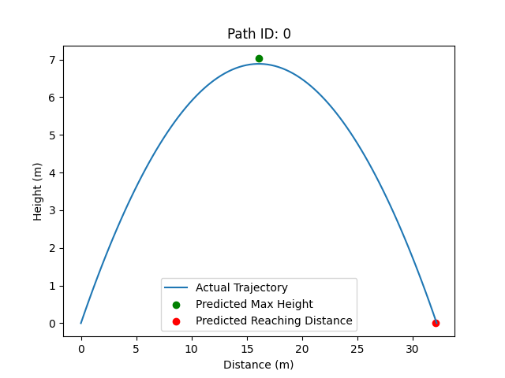

# Free-fall-surrogate

## 概要
このプロジェクトでは、サロゲートモデルを用いて自由落下運動を再現します。

- サロゲートモデルは、通常は数値解析やシミュレーションを要する複雑な物理現象を、機械学習で簡単かつ高速に再現する手法です。
- 初速度と発射角度の2つのパラメータを基に、自由落下の軌道を予測し、物理ベースのシミュレーションの効率化を目指します。
- 二次関数を使った理論上の放物線と、本プロジェクトのモデルによる推論結果を重ねたプロットを以下に示します。



## 開発環境
- ホストOS: Ubuntu 18.04 (Jetson Nano)
- コンテナOS: NVIDIA提供のベースイメージ (nvcr.io/nvidia/l4t-pytorch:r35.2.1-pth2.0-py3)
- Python: 3.8.10

## インストール方法
Dockerをインストールした後、以下のコマンドで`./Dockerfile`を参照してイメージのビルドを行います。
```
make docker-build
```
コンテナの起動は以下のコマンドで行います。
```
make docker-run
```
起動したコンテナには必要な依存関係などはすべてインストールされた状態になっています。

## 使い方
コンテナ内で実行できるコマンドとその実行内容を説明します。

放物線データを生成する
```
make generate_parabolic_data
```
生成されたデータは
- `./data/simulation/parabolic_motion.csv`に軌道(時刻、x座標、y座標)
- `data/simulation/parabolic_params.csv`に初速度と発射角度のパラメータ

がそれぞれ保存されます。

生成した放物線データをtrain, test, valの3つに分割する
```
make split
```
分割されたデータは
- training data: `./data/simulation/splits/train_motion_data.csv`, `./data/simulation/splits/train_params_data.csv`
- test data: `./data/simulation/splits/test_motion_data.csv`, `./data/simulation/splits/test_params_data.csv`
- validation data: `./data/simulation/splits/val_motion_data.csv`, `./data/simulation/splits/val_params_data.csv`

にそれぞれ保存されます。

学習の実行：
```
make train
```
学習が完了すると、モデルの重みが `./trained_models/` ディレクトリに `*.pth` ファイルとして保存されます。このファイルは、後でモデルをロードして推論に使用するためのものです。

MSEによるモデルの評価: 
```
make evaluate
```
テストデータと推論結果のMSEを出力します。

プロットの生成:
```
make evaluation_plots
```
実際の放物運動の軌道とモデルの推論結果を重ねたプロットを生成し、`./plots/actual_vs_predicted_path/`にランダムに選ばれた5つのプロットを`png`ファイルとして保存します

重力加速度や生成する軌道の数、train, test, valの比率、学習率などのトレーニングに関するパラメータは以下のファイルを編集することで変更できます。
```
cfg/cfg.yaml
```

# ユニットテスト
コンテナ内で実行できるユニットテストとその内容を説明します。

放物線の生成をテストする。
```
make test_parabolic_motion_generation
```

放物線データの分割をテストする。
```
make test_parabolic_motion_split
```

## プロジェクトのサマリー生成スクリプト
このプロジェクトでは、[Olemi-llm-apprenticeさん](https://github.com/Olemi-llm-apprentice)によって提供されている、プロジェクトのサマリーを生成するスクリプトを使用しています。このスクリプトはMITライセンスの下で提供されており、開発のワークフローに組み込んでいます。

ただし、このスクリプトは `.gitignore` によってバージョン管理から除外されており、リポジトリには含まれていません。スクリプトの元のソースコードやドキュメントについては[こちら](https://github.com/Olemi-llm-apprentice/generate-project-summary)をご覧ください。

## その他
特になし

_____

# Free-fall-surrogate

## Overview
This project aims to replicate free fall motion using a surrogate model.

- A surrogate model is a method that uses machine learning to replicate complex physical phenomena, which would typically require numerical analysis or simulation, in a simpler and faster manner.
- Based on two parameters, initial velocity and launch angle, the model predicts the trajectory of free fall, aiming to improve the efficiency of physics-based simulations.
- Below is a plot comparing the theoretical parabolic curve, derived from a quadratic function, with the predictions made by the model developed in this project.


## Development Environment
- Host OS: Ubuntu 18.04 (Jetson Nano)
- Container OS: NVIDIA-provided base image (nvcr.io/nvidia/l4t-pytorch:r35.2.1-pth2.0-py3)
- Python: 3.8.10

## Installation
After installing Docker, you can build the image by running the following command, which references `./Dockerfile`:

```
make docker-build
```

You can start the container by running:
```
make docker-run
```

The container will have all the necessary dependencies installed and ready to use.

## Usage
Below are the commands that can be executed within the container, along with their descriptions.

Generate parabolic motion data:
```
make generate_parabolic_data
```

The generated data is saved in the following locations:
- `./data/simulation/parabolic_motion.csv` for the trajectory (time, x-coordinate, y-coordinate)
- `data/simulation/parabolic_params.csv` for the parameters such as initial velocity and launch angle

Split the generated parabolic motion data into train, test, and validation sets:
```
make split
```

The split data is saved in the following locations:
- Training data: `./data/simulation/splits/train_motion_data.csv`, `./data/simulation/splits/train_params_data.csv`
- Test data: `./data/simulation/splits/test_motion_data.csv`, `./data/simulation/splits/test_params_data.csv`
- Validation data: `./data/simulation/splits/val_motion_data.csv`, `./data/simulation/splits/val_params_data.csv`

To run the training process, use the following command:
```
make train
```
After the training is complete, the model weights will be saved as a `*.pth` file in the `./trained_models/` directory. This file can be used later to load the model and perform inference.

**Evaluate with MSE**:
```
make evaluate
```
Outputs the Mean Squared Error (MSE) between the test data and the model's predictions.

**Generate Plots**:
 ```
make evaluation_plots
```
Generates plots comparing the actual parabolic trajectory with the model's predictions. The plots are saved as `png` files in `./plots/actual_vs_predicted_path/`, with 5 randomly selected samples.


You can modify parameters such as gravitational acceleration, the number of generated trajectories, the ratios for train, test, and validation sets, and parameters for training by editing the following file:
```
./cfg/cfg.yaml
```

# Unit Tests
Below are the unit tests that can be executed within the container, along with their descriptions.

Test the generation of parabolic motion:
```
make test_parabolic_motion_generation
```

Test the splitting of parabolic motion data:
```
make test_parabolic_motion_split
```

## Project Summary Script
This project utilizes a script for generating project summaries, which is provided by [Olemi-llm-apprentice](https://github.com/Olemi-llm-apprentice).
The script is licensed under the MIT License, and we have included it as part of our development workflow.

However, this script is excluded from version control via `.gitignore` and is not included in the repository.
You can access the original source and documentation for the script [here](https://github.com/Olemi-llm-apprentice/generate-project-summary).

## Others
Nothing in particular.
